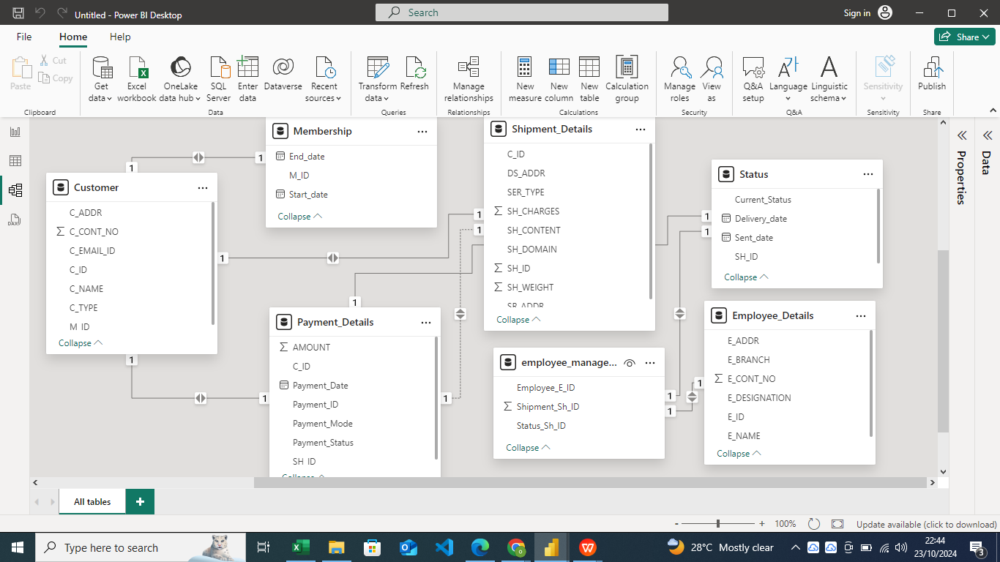

# Project: Logistics Support System

## Table of Contents

1. [Overview](#overview)
2. [Key Objectives](#key-objectives)
3. [Problem Description](#Problem-Description)
4. [Technology Used](#technology-used)
   - [Relational Database Management System (RDBMS)](#relational-database-management-system-rdbms)
5. [SQL Queries for Data Analysis](#sql-queries-for-data-analysis)
   - [Customer and Shipment Analysis](#customer-and-shipment-analysis)
   - [Membership and Payment Analysis](#membership-and-payment-analysis)
   - [Employee and Shipment Management](#employee-and-shipment-management)

## Overview

Logistics is the support function of an organization, involving **efficient resource management** by ensuring the right object is in the right place at the right time. This project focuses on:

- **Controlling the flow of resources** from one place to another.
- **Minimizing costs** while managing logistics with precision and attention.
- **Designing a system** that maintains detailed records of goods, including the type of content and shipment details for smooth delivery.

## Key Objectives

1. **Optimize Resource Allocation**:
   - Ensure the right resources are delivered at the right place, at the right time, to streamline operations.
   
2. **Cost Management**:
   - Focus on handling logistics costs efficiently and minimizing unnecessary expenditures.

3. **Comprehensive Record-Keeping**:
   - Keep detailed records of goods, including information about the shipment's content and delivery status.
  
## Problem Description 
The logistics company provides services in both the international and domestic sectors. 
The logistics management takes into consideration every facility that has an impact on 
cost. It plays an important role in making the product conform to customer requirements. 
Also, it involves efficient integration of suppliers, manufacturers, Import & export, and 
other activities at many levels; from the strategic level through the tactical to the 
operational level. 
Customers can send different types of shipping content. Payment is to be done at the same 
time the product is delivered to the client. The delivery boy and center head can update 
the status of the shipment. Create a database schema that can be 
used in any technology.

## Technology Used

### Relational Database Management System (RDBMS)

The project utilizes an **RDBMS** for efficient data management. The key benefits of using an RDBMS over a DBMS include:

- **Relational Data**: Entities and values in tables are interconnected, which improves data integrity.
- **Table Relationships**: Tables in the system are related to each other, enhancing the overall structure and management of the logistics data.
  

## SQL Queries for Data Analysis

### Customer and Shipment Analysis
1. **Count the customer base** based on customer type to identify current customer preferences and sort them in descending order.
2. **Count the customer base** based on their payment status in descending order.
3. **Count the customer base** based on their payment mode, sorted in descending order of count.
4. **Count the customers** by shipment domain, sorted in descending order.
5. **Count the customers** based on service type in descending order of count.
6. **Explore employee count** based on designation-wise count of employees' IDs in descending order.
7. **Branch-wise employee count** for delivery efficiency in descending order.

### Membership and Payment Analysis
8. **Find C_ID, M_ID, and tenure** for customers whose membership is over 10 years.
9. **Calculate the average payment amount** based on customer type for customers with COD payment mode, sorted in descending order.
10. **Calculate the average payment amount** based on payment mode where the payment date is not null.
11. **Calculate the average shipment weight** based on payment status where shipment content does not start with "H."

### Employee and Shipment Management
12. **Retrieve names and designations** of all employees in the 'NY' E_Branch.
13. **Calculate the total number of customers** in each C_TYPE (Wholesale, Retail, Internal Goods).
14. **Find membership start and end dates** for customers with a 'Paid' payment status.
15. **List the clients** who have made 'Card Payment' and have a 'Regular' service type.
16. **Calculate the average shipment weight** for each shipment domain (International and Domestic).
17. **Identify the shipment with the highest charges** and the corresponding client's name.
18. **Count the number of shipments** with the 'Express' service type that are yet to be delivered.
19. **List the clients** who have a 'Not Paid' payment status and are based in 'CA.'
20. **Retrieve the current status and delivery date** of shipments managed by employees with the designation 'Delivery Boy.'
21. **Find membership start and end dates** for customers whose 'Current Status' is 'Not Delivered.'
